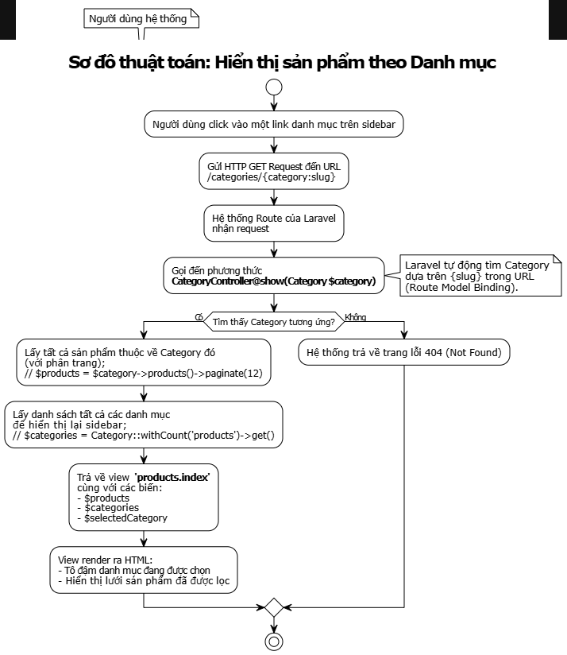
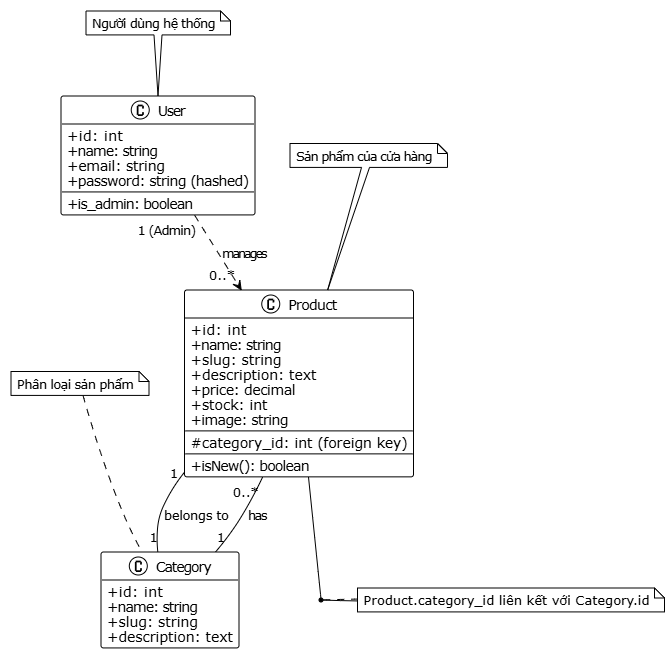

<p align="center">
<a href="https://github.com/laravel/framework/actions"></a>
<a href="https://packagist.org/packages/laravel/framework"></a>
<a href="https://packagist.org/packages/laravel/framework"></a>
<a href="https://packagist.org/packages/laravel/framework"></a>
</p>

Dự án Laravel: Quản lý Cửa hàng Đồ chơi & Văn phòng phẩm
Thông tin sinh viên
Họ tên sinh viên: Nguyễn Xuân Chức
Mã SV: 23010452
Giới thiệu Project
Đây là một dự án ứng dụng web được xây dựng bằng Laravel Framework, phục vụ cho việc quản lý một cửa hàng bán đồ chơi và văn phòng phẩm. Dự án bao gồm các chức năng cốt lõi của một hệ thống quản lý nội dung (CMS) và trang thương mại điện tử cơ bản.
Các công nghệ và chức năng chính:
Framework: Laravel 10.x.
Giao diện: Tailwind CSS.
Xác thực & Phân quyền: Sử dụng Laravel Breeze để quản lý đăng ký, đăng nhập. Hệ thống có 2 vai trò rõ rệt:
Admin: Quản lý toàn bộ sản phẩm, danh mục.
User/Guest: Xem sản phẩm, tìm kiếm.
Quản lý Đối tượng (CRUD): Xây dựng đầy đủ chức năng Thêm (Create), Xem (Read), Sửa (Update), Xóa (Delete) cho các đối tượng Sản phẩm (Product) và Danh mục (Category).
Tương tác Cơ sở dữ liệu: Sử dụng Eloquent ORM và Migrations để định nghĩa và tương tác với các bảng dữ liệu.
Bảo mật: Áp dụng các biện pháp bảo mật tiêu chuẩn của Laravel như CSRF Protection, XSS Protection (qua Blade escaping), Data Validation (qua Form Requests), và bảo vệ khỏi SQL Injection (qua Eloquent).
Sơ đồ cấu trúc (Class Diagram)
Sơ đồ thể hiện mối quan hệ giữa các Model chính trong dự án.
****
Sơ đồ thuật toán (Activity Diagram)
Thuật toán: Hiển thị sản phẩm theo Danh mục được chọn
Sơ đồ này mô tả luồng hoạt động khi người dùng click vào một danh mục ở sidebar để lọc sản phẩm.
****
Ảnh chụp màn hình chức năng chính
<details>
<summary><strong>Nhấn vào đây để xem ảnh chụp màn hình</strong></summary>
1. Trang chủ với Slider và Sản phẩm mới

2. Trang danh sách sản phẩm với Sidebar lọc danh mục

3. Trang quản lý sản phẩm (Admin)

4. Form Sửa sản phẩm với đầy đủ thông tin (Admin)

5. Trang quản lý danh mục (Admin)

</details>
Code minh họa phần chính
1. Model: Product.php
Mô hình hóa đối tượng Sản phẩm, định nghĩa các trường được phép gán và mối quan hệ belongsTo với Category.
Generated php
// File: app/Models/Product.php
namespace App\Models;

use Illuminate\Database\Eloquent\Factories\HasFactory;
use Illuminate\Database\Eloquent\Model;
use Illuminate\Database\Eloquent\Relations\BelongsTo;
use Illuminate\Database\Eloquent\Casts\Attribute;

class Product extends Model
{
    use HasFactory;

    protected $fillable = [
        'name',
        'slug',
        'description',
        'price',
        'stock',
        'image',
        'category_id'
    ];

    public function category(): BelongsTo
    {
        return $this->belongsTo(Category::class);
    }

    protected function isNew(): Attribute
    {
        return Attribute::make(
            get: fn () => $this->created_at->gt(now()->subDays(7)),
        );
    }
}
Use code with caution.
PHP
2. Controller: Admin/ProductController.php (Hàm update)
Đoạn code thể hiện logic xử lý request cập nhật sản phẩm, bao gồm validate dữ liệu, xử lý upload và xóa file ảnh, cập nhật vào CSDL.
Generated php
// File: app/Http/Controllers/Admin/ProductController.php
public function update(UpdateProductRequest $request, Product $product)
{
    // Lấy dữ liệu đã được validate từ Form Request
    $data = $request->validated();

    // Kiểm tra xem người dùng có tải lên file ảnh mới không
    if ($request->hasFile('image')) {
        // Xóa ảnh cũ nếu nó đã tồn tại
        if ($product->image) {
            Storage::disk('public')->delete($product->image);
        }
        
        // Lưu ảnh mới vào thư mục 'products' và lấy đường dẫn
        $data['image'] = $request->file('image')->store('products', 'public');
    }

    // Cập nhật sản phẩm với dữ liệu mới
    $product->update($data);

    // Chuyển hướng về trang danh sách
    return redirect()->route('admin.products.index')->with('success', 'Cập nhật sản phẩm thành công!');
}
Use code with caution.
PHP
3. View: admin/products/_form.blade.php (Partial View)
Đoạn code thể hiện việc tạo một form dùng chung cho cả chức năng Thêm và Sửa. Sử dụng các helper của Blade như @if, @foreach, old() để xử lý lỗi và hiển thị lại dữ liệu cũ.
Generated html
<!-- File: resources/views/admin/products/_form.blade.php -->

{{-- Hiển thị các lỗi validation nếu có --}}
@if ($errors->any())
    <div class="bg-red-100 border border-red-400 text-red-700 px-4 py-3 rounded relative mb-4">
        ...
    </div>
@endif

<div class="grid grid-cols-1 md:grid-cols-2 gap-6">
    {{-- Cột bên trái --}}
    <div class="space-y-6">
        <div>
            <label for="name" class="block text-sm font-medium text-gray-700">Tên sản phẩm</label>
            <input type="text" name="name" id="name" value="{{ old('name', $product->name ?? '') }}" class="..." required>
        </div>
        <div>
            <label for="category_id" class="block text-sm font-medium text-gray-700">Danh mục</label>
            <select name="category_id" id="category_id" class="..." required>
                <option value="">-- Chọn danh mục --</option>
                @foreach($categories as $category)
                    <option value="{{ $category->id }}" @selected(old('category_id', $product->category_id ?? '') == $category->id)>
                        {{ $category->name }}
                    </option>
                @endforeach
            </select>
        </div>
    </div>

    {{-- Cột bên phải --}}
    <div class="space-y-6">
        ...
        <div>
            <label for="image" class="block text-sm font-medium text-gray-700">Ảnh sản phẩm</label>
            <input type="file" name="image" id="image" class="...">
            
            @if(isset($product) && $product->image)
                <div class="mt-4">
                    <p class="text-sm text-gray-500">Ảnh hiện tại:</p>
                    image) }}" alt="{{ $product->name }}" class="...">
                </div>
            @endif
        </div>
    </div>
</div>


## Code Minh Họa Phần Chính
```php
###1. Model 'User' và các mối quan hệ phức tạp
*File: app/Models/Product.php

public function category(): BelongsTo
    {
        return $this->belongsTo(Category::class);
    }

     protected function isNew(): Attribute
    {
        return Attribute::make(
            get: fn () => $this->created_at->gt(now()->subDays(7)),
        );
    }
```

###2. Logic CRUD.Product
*File: app/Http/Controller/ProductController.php
```php
public function index()
    {

        $categories = Category::withCount('products')->get();
        // Lấy tất cả sản phẩm, sắp xếp theo ngày tạo mới nhất và phân trang (12 sản phẩm mỗi trang)
        $products = Product::latest()->paginate(12);

        return view('products.index', compact('products', 'categories'));
    }

    public function edit(Product $product)
{
    dd('Hàm edit đã được gọi', $product); // Thêm dòng này vào

    $categories = Category::all();
    return view('admin.products.edit', compact('product', 'categories'));
}
```

###3. Giao diện CRUD cho product
*File: resources/views/admin/products/show.blade.php
```php
<x-app-layout>
    <div class="bg-white">
        <div class="pt-6 pb-16 sm:pb-24">
            <div class="max-w-7xl mx-auto px-4 sm:px-6 lg:px-8">
                <div class="lg:grid lg:grid-cols-2 lg:gap-x-8">
                    <!-- Cột bên trái: Ảnh sản phẩm -->
                    <div class="aspect-w-4 aspect-h-5 sm:rounded-lg sm:overflow-hidden lg:aspect-w-3 lg:aspect-h-4">
                        image ? asset('storage/' . $product->image) : 'https://via.placeholder.com/600x750?text=No+Image' }}" alt="{{ $product->name }}" class="w-full h-full object-center object-cover">
                    </div>

                    <!-- Cột bên phải: Thông tin sản phẩm -->
                    <div class="mt-10 lg:mt-0 lg:col-start-2 lg:row-span-2 lg:self-start">
                        <div class="flex justify-between">
                            <h1 class="text-3xl font-bold tracking-tight text-gray-900">{{ $product->name }}</h1>
                        </div>

                        <div class="mt-4">
                            <p class="text-3xl tracking-tight text-gray-900">{{ number_format($product->price, 0, ',', '.') }} đ</p>
                        </div>

                        <div class="mt-6">
                            <h3 class="sr-only">Mô tả</h3>
                            <div class="text-base text-gray-700 space-y-6">
                                <p>{{ $product->description }}</p>
                            </div>
                        </div>

                        <section aria-labelledby="details-heading" class="mt-10">
                            <div class="divide-y divide-gray-200 border-t">
                                <!-- Danh mục -->
                                <div class="py-6">
                                    <h3 class="text-sm font-medium text-gray-900">Danh mục</h3>
                                    <div class="mt-2">
                                        <a href="#" class="inline-flex items-center px-3 py-1 rounded-full text-sm font-medium bg-indigo-100 text-indigo-800 hover:bg-indigo-200">
                                            {{ $product->category->name }}
                                        </a>
                                    </div>
                                </div>
                                
                                <!-- Tồn kho -->
                                <div class="py-6">
                                     <h3 class="text-sm font-medium text-gray-900">Tồn kho</h3>
                                    <div class="mt-2">
                                        <p class="text-base text-gray-700">
                                            @if($product->stock > 0)
                                                Còn hàng ({{ $product->stock }} sản phẩm)
                                            @else
                                                <span class="text-red-600">Hết hàng</span>
                                            @endif
                                        </p>
                                    </div>
                                </div>
                            </div>
                        </section>

                        <!-- Form thêm vào giỏ hàng -->
                        <form action="{{ route('cart.add') }}" method="POST">
    @csrf
    <input type="hidden" name="id" value="{{ $product->id }}">
    <input type="hidden" name="name" value="{{ $product->name }}">
    <input type="hidden" name="price" value="{{ $product->price }}">
    <input type="hidden" name="quantity" value="1">
    <button type="submit" ...>Thêm vào giỏ hàng</button>
</form>
                    </div>
                </div>
            </div>
        </div>
    </div>
</x-app-layout>
```
###. Liên kết

Link Repository: [https://github.com/chucngook/webnangcao_Toystore_23010452]
Link Readme.io: [https://chucngook.github.io/Webnc_README/]
